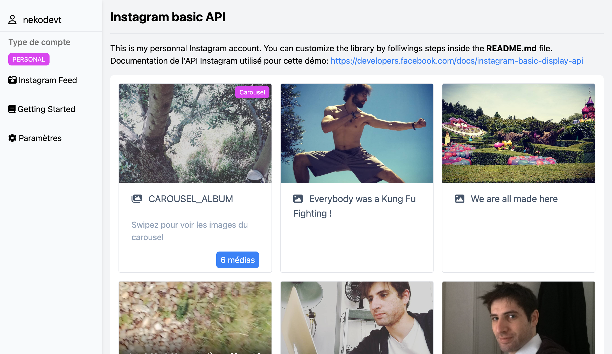
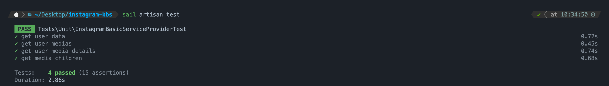

# Big Boss Studio Test



## Install the project

Clone the project and install php dependencies with `composer install` command. Well, run `sail up -d` command for starting the app and run migrations with `sail artisan migrate` command.

📣 You need configure your `.env` file before running the app. Please, follow the **Instagram Basic API - Getting started** section. Finally, you will can run the `npm run dev` command and go to `http://localhost` url.

## Instagram Basic API - Getting started

This is a simple Instagram Basic API application. You can use this application for getting your Instagram feed.

For getting started, you need to follow these steps:

### Step 1

-   Create a new Instagram application from [https://developers.facebook.com/apps](https://developers.facebook.com/apps)

### Step 2

-   Add a test user

### Step 3

After these steps, you need to configure `INSTAGRAM_APP_ID` and `INSTAGRAM_APP_SECRET` keys in your `.env` file.
Then, you need to get user authorization and an access token.

1. Call this URL (with GET method) for getting user authorization with correct data: `https://api.instagram.com/oauth/authorize?client_id={your-client-id}&redirect_uri={your-redirect-uri}&scope=user_profile,user_media&response_type=code`
2. Get your access token by calling with the POST method: `https://api.instagram.com/oauth/access_token` with these body:

| Field        | Description                                           |
| ------------ | ----------------------------------------------------- |
| client_id    | Your Instagram app id                                 |
| app_secret   | Your Instagram secret key                             |
| grant_type   | authorization_code                                    |
| redirect_uri | A valid redirect URI                                  |
| code         | The code get from the previous step (without the #\_) |

---

3. Now, getting a long life access token with the GET method: `https://graph.instagram.com/access_token?grant_type=ig_exchange_token&client_secret={your-client-secret}&access_token={your-access-token}`

4. Finally, set the `.env` variables `INSTAGRAM_ACCESS_TOKEN` and `INSTAGRAM_EXPIRES_IN` with the values get from the previous step.

🎉 Great! You can now use the Instagram Basic API service provider! Enjoy!

## Example of `.env` file

```shell
APP_NAME=Laravel
APP_ENV=local
APP_KEY=base64:X7p8Qtig4ygnRnPp/R5yvC7Z/O+lz58UvsRpLB199x0=
APP_DEBUG=true
APP_URL=http://localhost

LOG_CHANNEL=stack
LOG_DEPRECATIONS_CHANNEL=null
LOG_LEVEL=debug

DB_CONNECTION=mysql
DB_HOST=mysql
DB_PORT=3306
DB_DATABASE=instagram_bbs
DB_USERNAME=sail
DB_PASSWORD=password

BROADCAST_DRIVER=log
CACHE_DRIVER=file
FILESYSTEM_DISK=local
QUEUE_CONNECTION=sync
SESSION_DRIVER=file
SESSION_LIFETIME=120

MEMCACHED_HOST=127.0.0.1

REDIS_HOST=redis
REDIS_PASSWORD=null
REDIS_PORT=6379

MAIL_MAILER=smtp
MAIL_HOST=mailpit
MAIL_PORT=1025
MAIL_USERNAME=null
MAIL_PASSWORD=null
MAIL_ENCRYPTION=null
MAIL_FROM_ADDRESS="hello@example.com"
MAIL_FROM_NAME="${APP_NAME}"

AWS_ACCESS_KEY_ID=
AWS_SECRET_ACCESS_KEY=
AWS_DEFAULT_REGION=us-east-1
AWS_BUCKET=
AWS_USE_PATH_STYLE_ENDPOINT=false

PUSHER_APP_ID=
PUSHER_APP_KEY=
PUSHER_APP_SECRET=
PUSHER_HOST=
PUSHER_PORT=443
PUSHER_SCHEME=https
PUSHER_APP_CLUSTER=mt1

VITE_APP_NAME="${APP_NAME}"
VITE_PUSHER_APP_KEY="${PUSHER_APP_KEY}"
VITE_PUSHER_HOST="${PUSHER_HOST}"
VITE_PUSHER_PORT="${PUSHER_PORT}"
VITE_PUSHER_SCHEME="${PUSHER_SCHEME}"
VITE_PUSHER_APP_CLUSTER="${PUSHER_APP_CLUSTER}"

SCOUT_DRIVER=meilisearch
MEILISEARCH_HOST=http://meilisearch:7700

INSTAGRAM_APP_ID=6005491612830147
INSTAGRAM_APP_SECRET=3e85e4a850dd95391075df43f9b2359d
INSTAGRAM_ACCESS_TOKEN=IGVJXWnM4MG5qYjFMX2M2SFU1NFdYeEZApTTFVWE9uN3gwN00SU9zdjVkWndGd0Q2Q0psd3NCaWx4VVE2cW1tbkJhdmJqSlEzWWZAHYjRkMzBacWhYS2RPRS15eldMalFnS1NXNE93
INSTAGRAM_EXPIRES_IN=5130556
```

## Run tests

You can test your app by run test with artisan command

```shell
sail artisan test
```


